# The Cloud: An Introduction

Sample application and supporting docs for Prime Digital Academy guest lecture, Apr 9, 2020.

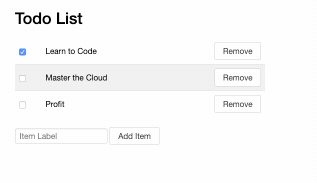

In this readme, we'll walk through how this application works, how to run it locally, and how to deploy it to the cloud on AWS.

<!--
Generated with markdown-toc
https://github.com/jonschlinkert/markdown-toc
markdown-toc -i README.md --maxdepth 3
-->

<!-- toc -->

- [Overview of the Code](#overview-of-the-code)
  * [API Reference](#api-reference)
- [Running the code locally](#running-the-code-locally)
- [Deploying to The Cloud (AWS)](#deploying-to-the-cloud-aws)
  * [Sign up for an AWS Account](#sign-up-for-an-aws-account)
  * [Create an EC2 Instance](#create-an-ec2-instance)
  * [SSH into your machine](#ssh-into-your-machine)
  * [Deploy this application to your EC2 Instance](#deploy-this-application-to-your-ec2-instance)
  * [IMPORTANT: Make a budget!](#important-make-a-budget)

<!-- tocstop -->

## Overview of the Code

There are two main components to this application:

1. A REST **API server**, to list, create, update, and delete todo list items.
2. A **client application** with the todo list user interface.

The **API server is written in Javascript (Node.js) using the [express.js](https://expressjs.com/) web framework. We're using a simple "in-memory" array of todo list objects as our data store (there is no actual Database, to keep things simple).

The API server code is located in [server.js](./server.js).

The **client application** is written using HTML, CSS, and Javascript. The Javascript code makes HTTP (AJAX) requests to the API server, and renders the results as HTML.

The client application code is located in [views/index.html](./views/index.html).

### API Reference

We expose our data via RESTful API endpoints. For example:

```
Retrive a list of todo items

GET /api/

HTTP 200
[
    {
        id: 0, 
        label: 'Learn to Code', 
        isDone: true
    },
    {
        id: 1, 
        label: 'Master the Cloud', 
        isDone: false
    }
]
```

```
Create a new todo list item

POST /api/
{
    label: "Profit",
    isDone: false
}

HTTP 201
{
    id: 2,
    label: "Profit",
    isDone: false
}
```

```
Update the todo list item, with id=2

PUT /api/2
{
    isDone: true
}

HTTP 201
{
    id: 2,
    label: "Profit",
    isDone: true
}
```

```
Delete the todo list item, with id=2

DELETE /api/2
HTTP 204
```


## Running the code locally 

To run the web server locally, you will first need to install your node dependencies (eg. express.js). From your terminal/command-line, go to the project directory and run:

```
npm install 
```

Then to start the web server:

```
node ./server.js
```

After a moment, you should see a message like:

```
App running at http://localhost:8080
``` 

That means your web server is up and running. Paste that URL (http://localhost:8080) into your browser. You should see the _Todo List_ application:
@
 

To shut down the web server, go back to your Terminal / Command Line, and hit `Ctrl+C`.

## Deploying to The Cloud (AWS)

We can take this same code we've run locally on our own computers, and deploy it to a "virtual machine" running in the cloud on AWS.

### Sign up for an AWS Account

To deploy code to AWS, you will first need an AWS account. AWS provides a "free tier" account, which will give you access to basic AWS services at no cost for 12 months. Everything described in these docs will be available in your free tier account.

To sign up, visit:

 https://aws.amazon.com/free
 
and follow the instructions for setting up your account. Note that you **will need a credit card** on hand to sign up.

### Create an EC2 Instance

First, login to your AWS account:

https://console.aws.amazon.com/

Then under _Find Services_ type in _EC2_, and select the _EC2_ link from the dropdown:

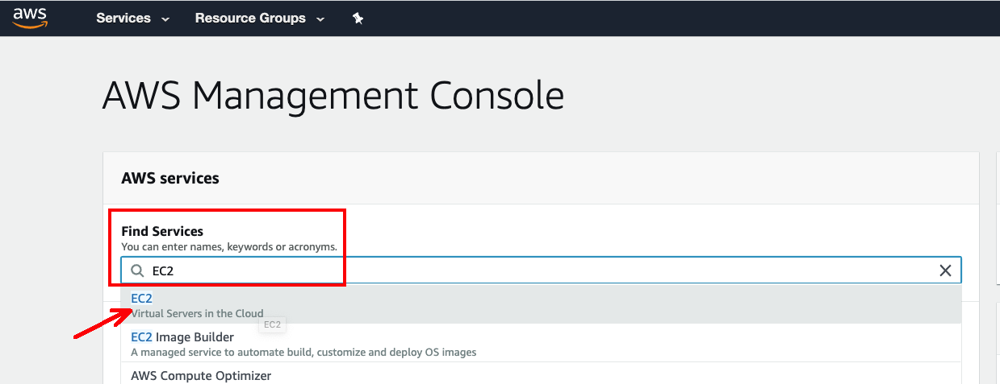

In the side navigation, select _Instances_, then click the big blue _Launch Instance_ button:

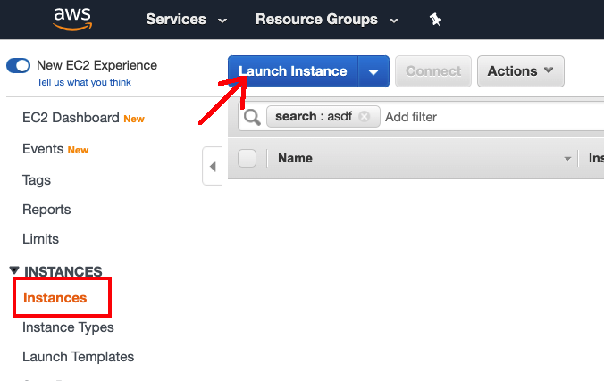

You will be prompted to choose a _Amazon Machine Image_. This is a fancy way of asking why kind of operating system you want on your virtual machine. For this demo, we'll use Ubuntu, a popular Linux OS. Scroll down until you find _Ubuntu Server 18.04_, and select that option:

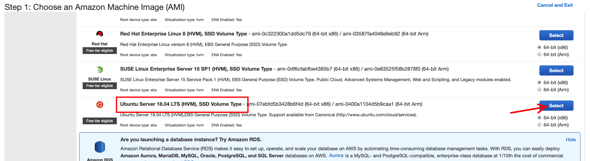

The next screen, _Choose an Instance Type_, allows you to decide how powerful you want your machine to be. For this demo, we can use a t2.micro, which qualifies for free tier pricing. Make sure that type is selected, an click _Next_:

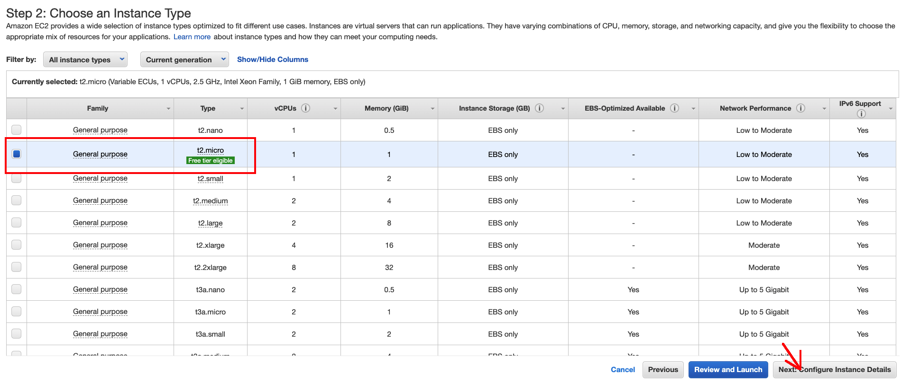


Continue to click _Next_, until you get to _Step 6: Configure Security Group_. This is where we configure what kind of network traffic we're allowing into our machine. By default, we accept SSH traffic (port 22), but we'll also need to accept HTTP traffic (port 80) to run our web server.

Click _Add Rule_, then select _HTTP_. Then click the _Review and Launch_ button:

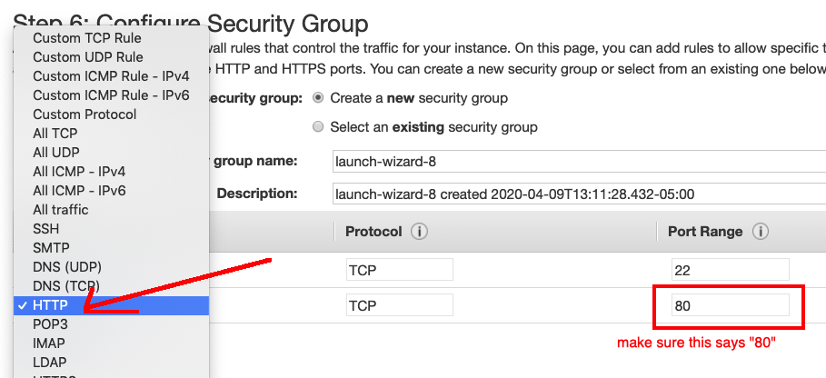

And then click _Launch_. You'll be prompted to create a new "key pair". This is a special file created by AWS which acts kind of like a password for logging into your virtual machine. 

Select _Create a new key pair_ (1), then give the key a name, like "my-machine" (2), then download the key (3), then click _Launch Instance_ (3):

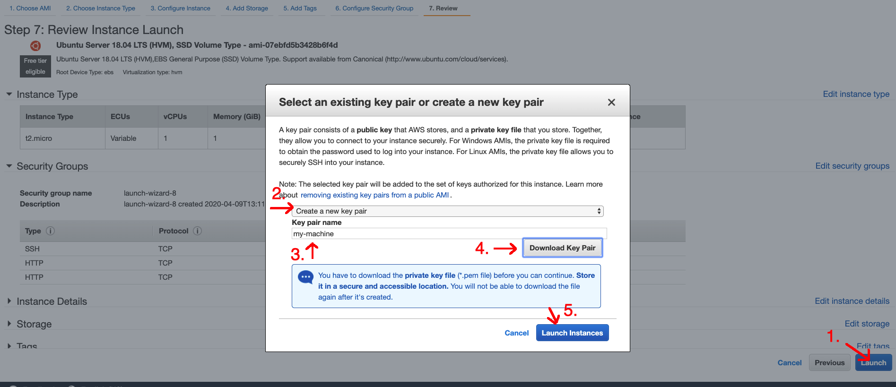

You virtual machine ("EC2 Instance") is now being created! Click on the instance ID to view its status:

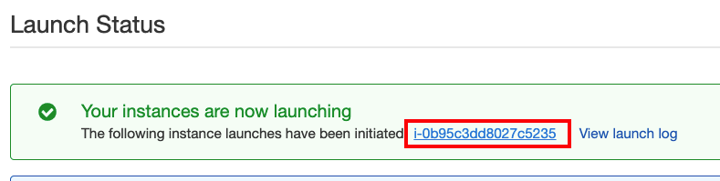

..and wait until the _Instance State_ says "running":

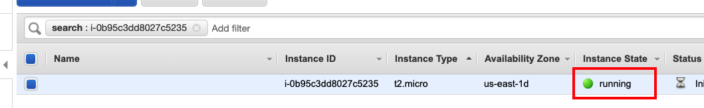

Congratulations! You've created a virtual machine in the cloud!


### SSH into your machine

So your virtual machine is up and running. But into order to _do_ anything with it, you'll need to SSH into it.

**This guide will assume you're running on a Mac or Linux machine**
For using SSH with windows, [see this guide from the AWS docs](https://docs.aws.amazon.com/AWSEC2/latest/UserGuide/putty.html)

First, will need to find the key pair file we created in the last section. If you're on a Mac, it should be in `~/Downloads/my-machine.pem`. Let's move it somewhere safer, where we won't accidentally delete it.

Open your Terminal, and run the following commands:

```
mkdir -p ~/.ssh
mv ~/Downloads/my-machine.pem ~/.ssh
chmod 400 ~/.ssh/my-machine.pem
```  

That moves the file to a directory called `.ssh`, within your home directory. The last line (`chmod`) changes the permissions on the file, to keep it secure.

Next, we'll need to know the web address our our virtual machine. Every virtual machine created in AWS gets a "Public IP address", which is basically like a web address for machine. Let's go back to the AWS EC2 dashboard, to find the public IP address:

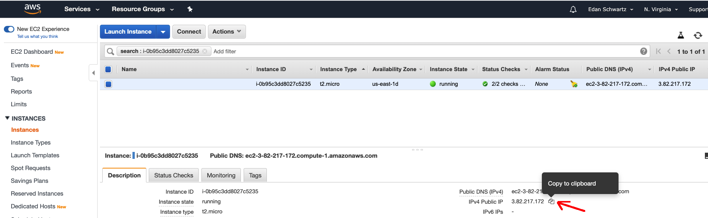

Then back in our terminal, we'll use that IP address along with your key pair file to SSH into the machine. Enter this command, replacing `PUBLIC_IP_ADDRESS` with the actual IP address of your virtual machine in EC2.

```
ssh -i ~/.ssh/my-machine.pem ubuntu@PUBLIC_IP_ADDRESS
```

This should prompt you with something like:

```
The authenticity of host '3.82.217.172 (3.82.217.172)' can't be established.
ECDSA key fingerprint is SHA256:XfER1WQPBOUuUBcG54tv60RewLD9dkhugs5zFHFfEwI.
Are you sure you want to continue connecting (yes/no)?
```

Type in `yes` and press `ENTER`.

You should then see a new command line prompt, like:

```
ubuntu@ip-123-45-67-890:~$
```

You have now SSH'd into your machine! Any commands you type now will be sent to that virtual machine.

If you're running into any trouble with the SSH connection, see the [AWS docs for SSH'ing to EC2](https://docs.aws.amazon.com/AWSEC2/latest/UserGuide/AccessingInstancesLinux.html).


### Deploy this application to your EC2 Instance

Our final step is to do a bit of server setup, and then deploy and run our application.

With your SSH connection active (see last step), run the following commands:

```
sudo apt update
sudo apt install -y nodejs npm
``` 

This will install Node.js and npm, which we need to run our server. This may take a minute...

Once that's complete, we will need a way to get a web server code onto the server. For this, we'll use git to clone our application repo:

```
git clone https://github.com/eschwartz/prime-cloud-intro.git
cd prime-cloud-intro
```

We now have our application code (from this repo) running on our virtual machine. Next we need to install our dependencies (express.js) with npm:

```
npm install
```

Finally, we can start up our web server

```
sudo npm start
```

If everything is working correctly, your web server should be up and running. You should see some log output like:

```
App running at http://12.34.56.78:80
```

Copy that URL into your web browser. You should see the _Todo List_ web app up and running on the cloud!


### IMPORTANT: Make a budget!

One last small warning: even with a "free tier" account, it is still possible to spend (lots of) money on AWS. For example, if you choose the wrong instance type (running a supercomputer in AWS is $$$!).

So couple recommendations:

**1. Get in the habit of cleaning up after yourself.**

When you're done with this demo, go back to your EC2 dashboard, and terminate the instance:

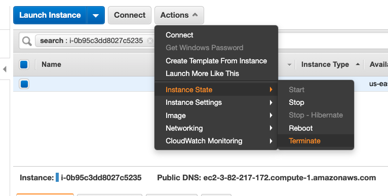

Try to always do this after running anything in AWS, to prevent any surprise bills at the end of the month.

**2. Create a Budget**

AWS has a _Budgets_ service, which will notify you if you spend more than you intended to. So if you do accidentally choose to run a supercomputer in AWS, it will only charge you for the first few hours, before sending you a notification that you're over budget.

See [AWS docts for _Creating a Cost Budget_](https://docs.aws.amazon.com/awsaccountbilling/latest/aboutv2/budgets-create.html#create-cost-budget)
